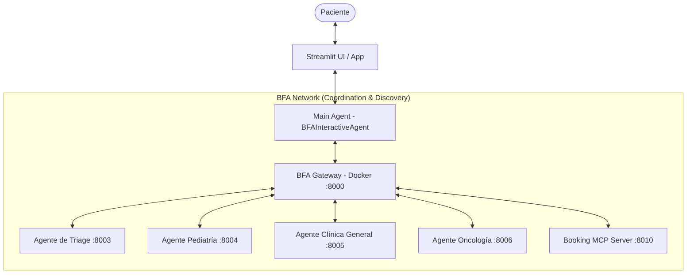

# 🏥 Clinic Sample — Arquitectura Multi-Agente con BFA Gateway & MCP

Este repositorio contiene la implementación de referencia para la serie de artículos en **Dev.TO** sobre **Arquitecturas Multi-Agente en Salud**.

El proyecto demuestra cómo coordinar múltiples agentes inteligentes y servidores de herramientas (MCP) utilizando el **BFA Gateway**, ofreciendo una experiencia conversacional fluida con memoria de sesión, reducción de contexto, ruteo por intención y reserva automatizada de turnos.

---

## 🏛️ Arquitectura del Sistema



### Componentes Principales

1. **BFA Gateway (`sandrog77/bfa-gateway`)**: Servidor central en Docker encargado del descubrimiento de agentes, intercambio criptográfico de llaves (ED25519) y ruteo semántico de consultas.
2. **Main Agent (`main_agent.py`)**: Agente interactivo basado en `BFAInteractiveAgent`.
   - **Memoria de Sesión (`MemoryStack`)**: Mantiene el historial completo de la conversación por usuario.
   - **Reducción de Contexto (LLM Reducer)**: Consolida el historial en un *query* atómico y sin redundancias antes de enviar la solicitud al Gateway.
   - **Sintetizador de Respuesta**: Transforma las respuestas técnicas o de herramientas en mensajes cálidos y empáticos para el paciente.
3. **Agente de Triage (`triage.py`)**: Evalúa la sintomatología inicial y encausa la atención al departamento médico correcto.
4. **Agentes Especialistas**:
   - **Pediatría (`pediatria.py`)**
   - **Clínica General (`clinica_general.py`)**
   - **Oncología (`oncologia.py`)**
5. **Servidor MCP de Turnos (`booking_mcp.py`)**: Servidor basado en `BFAMCP` / `FastMCP` que expone la herramienta `agendar_turno` para reservar citas médicas.
6. **Interfaz Web (`streamlit_chat.py`)**: Chat conversacional construido en Streamlit.

---

## 📋 Requisitos Previos

- **Docker / Docker Desktop** (para el BFA Gateway).
- **Python 3.10+**
- **OpenAI API Key** (configurada en el archivo `.env`).

---

## 🚀 Guía de Inicio Rápido

### 1. Clonar el Repositorio

```bash
git clone https://github.com/IRC-A/clinic-sample.git
cd clinic-sample
```

### 2. Iniciar el BFA Gateway (Docker)

El BFA Gateway se distribuye listo para usar desde DockerHub:

```bash
docker pull sandrog77/bfa-gateway
docker run -d -p 8000:8000 --name bfa-gateway sandrog77/bfa-gateway
```

### 3. Configurar el Entorno de Python y Variables de Entorno

```bash
# Crear y activar entorno virtual
python3 -m venv .venv
source .venv/bin/activate

# Instalar dependencias
pip install -r requirements.txt
```

Crea un archivo `.env` en la raíz del proyecto (puedes basarte en el archivo de ejemplo) y coloca tu clave de OpenAI:

```bash
BFA_GATEWAY_URL=http://localhost:8000/
OPENAI_API_KEY=sk-tu-api-key-aqui
HOSPITAL_NAME="La Clínica del Dr. Cureta"
```

### 4. Iniciar Todos los Agentes y el Servidor MCP

Ejecuta el script automatizado para lanzar todos los agentes en segundo plano:

```bash
chmod +x scripts/start_all_agents.sh scripts/stop_all_agents.sh
./scripts/start_all_agents.sh
```

Este script iniciará:
- `triage` en `http://0.0.0.0:8003`
- `pediatria` en `http://0.0.0.0:8004`
- `clinica_general` en `http://0.0.0.0:8005`
- `oncologia` en `http://0.0.0.0:8006`
- `booking_mcp` en `http://0.0.0.0:8010`
- `main_agent` en `http://0.0.0.0:8310`

### 5. Lanzar la Interfaz de Usuario (Streamlit)

En una nueva terminal (con el entorno virtual activado):

```bash
streamlit run apps/streamlit_chat.py
```

Abre tu navegador en `http://localhost:8501` para comenzar a interactuar con la clínica.

---

## 🛑 Detener los Servicios

Para apagar todos los agentes en segundo plano:

```bash
./scripts/stop_all_agents.sh
```

Para detener el contenedor del Gateway:

```bash
docker stop bfa-gateway
```

---

## 📁 Estructura del Proyecto

```text
.
├── apps/
│   └── streamlit_chat.py        # Interfaz de usuario Streamlit
├── scripts/
│   ├── start_all_agents.sh      # Script de inicio masivo de agentes
│   └── stop_all_agents.sh       # Script de apagado de agentes
├── src/
│   └── agents/
│       ├── main_agent/          # Agente Interactivo Frontend (Reducción + Sintetización)
│       ├── triage/              # Agente de Triage y enrutamiento inicial
│       ├── pediatria/           # Agente Especialista en Pediatría
│       ├── clinica_general/     # Agente Especialista en Clínica General
│       ├── oncologia/           # Agente Especialista en Oncología
│       └── booking_mcp/         # Servidor MCP para reserva de turnos
├── .env                         # Variables de entorno globales
├── prompt_articulo_devto.md     # Prompt guía para la redacción del post en Dev.TO
└── README.md
```

---

## 📖 Artículo en Dev.TO

Este repositorio acompaña el artículo detallado publicado en Dev.TO. Consulta el archivo `prompt_articulo_devto.md` para ver el esquema explicativo paso a paso.

---

## 📄 Licencia

Este proyecto está bajo la licencia [MIT](LICENSE).
